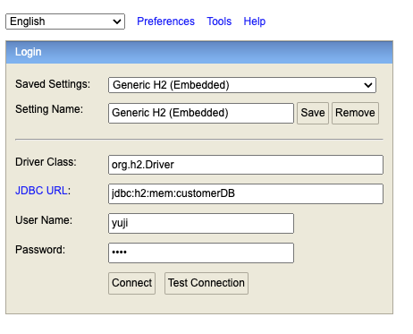
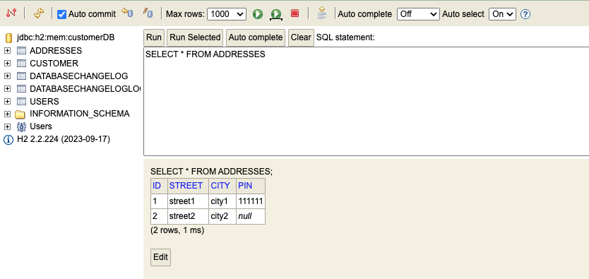
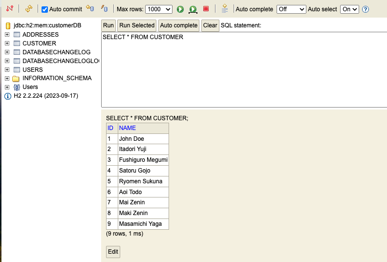
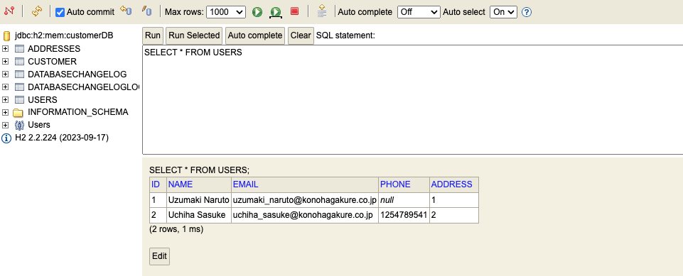
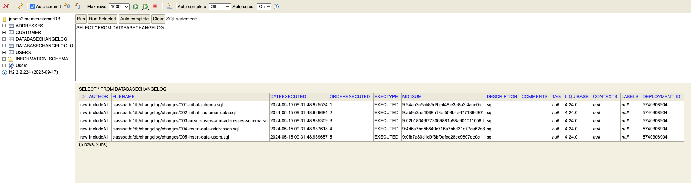
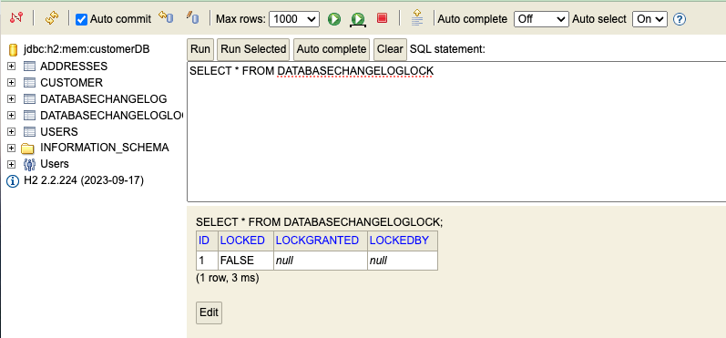

# spring-boot-liquibase-sql

### Things todo list

1. Clone this repository: `git clone https://github.com/hendisantika/spring-boot-liquibase-sql.git`
2. Navigate to the folder: `cd spring-boot-liquibase-sql`
3. Run the application: `mvn clean spring-boot:run`
4. Open H2 Console: http://localhost:8080/h2-console
5. Input yuji as username & password the hit connect button
6. Check your Spring Boot App Console log

```shell

  .   ____          _            __ _ _
 /\\ / ___'_ __ _ _(_)_ __  __ _ \ \ \ \
( ( )\___ | '_ | '_| | '_ \/ _` | \ \ \ \
 \\/  ___)| |_)| | | | | || (_| |  ) ) ) )
  '  |____| .__|_| |_|_| |_\__, | / / / /
 =========|_|==============|___/=/_/_/_/
 :: Spring Boot ::                (v3.2.5)

2024-05-15T09:31:47.953+07:00  INFO 77542 --- [spring-boot-liquibase-sql] [  restartedMain] .m.h.s.SpringBootLiquibaseSqlApplication : Starting SpringBootLiquibaseSqlApplication using Java 21 with PID 77542 (/Users/hendisantika/IdeaProjects/spring-boot-liquibase-sql/target/classes started by hendisantika in /Users/hendisantika/IdeaProjects/spring-boot-liquibase-sql)
2024-05-15T09:31:47.954+07:00  INFO 77542 --- [spring-boot-liquibase-sql] [  restartedMain] .m.h.s.SpringBootLiquibaseSqlApplication : No active profile set, falling back to 1 default profile: "default"
2024-05-15T09:31:47.979+07:00  INFO 77542 --- [spring-boot-liquibase-sql] [  restartedMain] .e.DevToolsPropertyDefaultsPostProcessor : Devtools property defaults active! Set 'spring.devtools.add-properties' to 'false' to disable
2024-05-15T09:31:47.979+07:00  INFO 77542 --- [spring-boot-liquibase-sql] [  restartedMain] .e.DevToolsPropertyDefaultsPostProcessor : For additional web related logging consider setting the 'logging.level.web' property to 'DEBUG'
2024-05-15T09:31:48.264+07:00  INFO 77542 --- [spring-boot-liquibase-sql] [  restartedMain] .s.d.r.c.RepositoryConfigurationDelegate : Bootstrapping Spring Data JPA repositories in DEFAULT mode.
2024-05-15T09:31:48.287+07:00  INFO 77542 --- [spring-boot-liquibase-sql] [  restartedMain] .s.d.r.c.RepositoryConfigurationDelegate : Finished Spring Data repository scanning in 18 ms. Found 1 JPA repository interface.
2024-05-15T09:31:48.539+07:00  INFO 77542 --- [spring-boot-liquibase-sql] [  restartedMain] o.s.b.w.embedded.tomcat.TomcatWebServer  : Tomcat initialized with port 8080 (http)
2024-05-15T09:31:48.551+07:00  INFO 77542 --- [spring-boot-liquibase-sql] [  restartedMain] o.apache.catalina.core.StandardService   : Starting service [Tomcat]
2024-05-15T09:31:48.551+07:00  INFO 77542 --- [spring-boot-liquibase-sql] [  restartedMain] o.apache.catalina.core.StandardEngine    : Starting Servlet engine: [Apache Tomcat/10.1.20]
2024-05-15T09:31:48.570+07:00  INFO 77542 --- [spring-boot-liquibase-sql] [  restartedMain] o.a.c.c.C.[Tomcat].[localhost].[/]       : Initializing Spring embedded WebApplicationContext
2024-05-15T09:31:48.571+07:00  INFO 77542 --- [spring-boot-liquibase-sql] [  restartedMain] w.s.c.ServletWebServerApplicationContext : Root WebApplicationContext: initialization completed in 590 ms
2024-05-15T09:31:48.584+07:00  INFO 77542 --- [spring-boot-liquibase-sql] [  restartedMain] com.zaxxer.hikari.HikariDataSource       : HikariPool-1 - Starting...
2024-05-15T09:31:48.673+07:00  INFO 77542 --- [spring-boot-liquibase-sql] [  restartedMain] com.zaxxer.hikari.pool.HikariPool        : HikariPool-1 - Added connection conn0: url=jdbc:h2:mem:customerDB user=YUJI
2024-05-15T09:31:48.673+07:00  INFO 77542 --- [spring-boot-liquibase-sql] [  restartedMain] com.zaxxer.hikari.HikariDataSource       : HikariPool-1 - Start completed.
2024-05-15T09:31:48.678+07:00  INFO 77542 --- [spring-boot-liquibase-sql] [  restartedMain] o.s.b.a.h2.H2ConsoleAutoConfiguration    : H2 console available at '/h2-console'. Database available at 'jdbc:h2:mem:customerDB'
2024-05-15T09:31:48.746+07:00  INFO 77542 --- [spring-boot-liquibase-sql] [  restartedMain] liquibase.database                       : Set default schema name to PUBLIC
2024-05-15T09:31:48.848+07:00  INFO 77542 --- [spring-boot-liquibase-sql] [  restartedMain] liquibase.changelog                      : Creating database history table with name: PUBLIC.DATABASECHANGELOG
2024-05-15T09:31:48.886+07:00  INFO 77542 --- [spring-boot-liquibase-sql] [  restartedMain] liquibase.changelog                      : Reading from PUBLIC.DATABASECHANGELOG
2024-05-15T09:31:48.904+07:00  INFO 77542 --- [spring-boot-liquibase-sql] [  restartedMain] liquibase.lockservice                    : Successfully acquired change log lock
2024-05-15T09:31:48.905+07:00  INFO 77542 --- [spring-boot-liquibase-sql] [  restartedMain] liquibase.command                        : Using deploymentId: 5740308904
2024-05-15T09:31:48.905+07:00  INFO 77542 --- [spring-boot-liquibase-sql] [  restartedMain] liquibase.changelog                      : Reading from PUBLIC.DATABASECHANGELOG
Running Changeset: classpath:/db/changelog/changes/001-initial-schema.sql::raw::includeAll
2024-05-15T09:31:48.921+07:00  INFO 77542 --- [spring-boot-liquibase-sql] [  restartedMain] liquibase.changelog                      : Custom SQL executed
2024-05-15T09:31:48.922+07:00  INFO 77542 --- [spring-boot-liquibase-sql] [  restartedMain] liquibase.changelog                      : ChangeSet classpath:/db/changelog/changes/001-initial-schema.sql::raw::includeAll ran successfully in 5ms
Running Changeset: classpath:/db/changelog/changes/002-initial-customer-data.sql::raw::includeAll
2024-05-15T09:31:48.928+07:00  INFO 77542 --- [spring-boot-liquibase-sql] [  restartedMain] liquibase.changelog                      : Custom SQL executed
2024-05-15T09:31:48.929+07:00  INFO 77542 --- [spring-boot-liquibase-sql] [  restartedMain] liquibase.changelog                      : ChangeSet classpath:/db/changelog/changes/002-initial-customer-data.sql::raw::includeAll ran successfully in 2ms
Running Changeset: classpath:/db/changelog/changes/003-create-users-and-addresses-schema.sql::raw::includeAll
2024-05-15T09:31:48.934+07:00  INFO 77542 --- [spring-boot-liquibase-sql] [  restartedMain] liquibase.changelog                      : Custom SQL executed
2024-05-15T09:31:48.934+07:00  INFO 77542 --- [spring-boot-liquibase-sql] [  restartedMain] liquibase.changelog                      : ChangeSet classpath:/db/changelog/changes/003-create-users-and-addresses-schema.sql::raw::includeAll ran successfully in 4ms
Running Changeset: classpath:/db/changelog/changes/004-insert-data-addresses.sql::raw::includeAll
2024-05-15T09:31:48.936+07:00  INFO 77542 --- [spring-boot-liquibase-sql] [  restartedMain] liquibase.changelog                      : Custom SQL executed
2024-05-15T09:31:48.936+07:00  INFO 77542 --- [spring-boot-liquibase-sql] [  restartedMain] liquibase.changelog                      : ChangeSet classpath:/db/changelog/changes/004-insert-data-addresses.sql::raw::includeAll ran successfully in 0ms
Running Changeset: classpath:/db/changelog/changes/005-insert-data-users.sql::raw::includeAll
2024-05-15T09:31:48.938+07:00  INFO 77542 --- [spring-boot-liquibase-sql] [  restartedMain] liquibase.changelog                      : Custom SQL executed
2024-05-15T09:31:48.939+07:00  INFO 77542 --- [spring-boot-liquibase-sql] [  restartedMain] liquibase.changelog                      : ChangeSet classpath:/db/changelog/changes/005-insert-data-users.sql::raw::includeAll ran successfully in 1ms
2024-05-15T09:31:48.941+07:00  INFO 77542 --- [spring-boot-liquibase-sql] [  restartedMain] liquibase.util                           : UPDATE SUMMARY
2024-05-15T09:31:48.941+07:00  INFO 77542 --- [spring-boot-liquibase-sql] [  restartedMain] liquibase.util                           : Run:                          5
2024-05-15T09:31:48.941+07:00  INFO 77542 --- [spring-boot-liquibase-sql] [  restartedMain] liquibase.util                           : Previously run:               0
2024-05-15T09:31:48.941+07:00  INFO 77542 --- [spring-boot-liquibase-sql] [  restartedMain] liquibase.util                           : Filtered out:                 0
2024-05-15T09:31:48.941+07:00  INFO 77542 --- [spring-boot-liquibase-sql] [  restartedMain] liquibase.util                           : -------------------------------
2024-05-15T09:31:48.941+07:00  INFO 77542 --- [spring-boot-liquibase-sql] [  restartedMain] liquibase.util                           : Total change sets:            5
2024-05-15T09:31:48.941+07:00  INFO 77542 --- [spring-boot-liquibase-sql] [  restartedMain] liquibase.util                           : Update summary generated
2024-05-15T09:31:48.942+07:00  INFO 77542 --- [spring-boot-liquibase-sql] [  restartedMain] liquibase.command                        : Update command completed successfully.
Liquibase: Update has been successful. Rows affected: 8
2024-05-15T09:31:48.943+07:00  INFO 77542 --- [spring-boot-liquibase-sql] [  restartedMain] liquibase.lockservice                    : Successfully released change log lock
2024-05-15T09:31:48.943+07:00  INFO 77542 --- [spring-boot-liquibase-sql] [  restartedMain] liquibase.command                        : Command execution complete
2024-05-15T09:31:48.985+07:00  INFO 77542 --- [spring-boot-liquibase-sql] [  restartedMain] o.hibernate.jpa.internal.util.LogHelper  : HHH000204: Processing PersistenceUnitInfo [name: default]
2024-05-15T09:31:49.012+07:00  INFO 77542 --- [spring-boot-liquibase-sql] [  restartedMain] org.hibernate.Version                    : HHH000412: Hibernate ORM core version 6.4.4.Final
2024-05-15T09:31:49.026+07:00  INFO 77542 --- [spring-boot-liquibase-sql] [  restartedMain] o.h.c.internal.RegionFactoryInitiator    : HHH000026: Second-level cache disabled
2024-05-15T09:31:49.130+07:00  INFO 77542 --- [spring-boot-liquibase-sql] [  restartedMain] o.s.o.j.p.SpringPersistenceUnitInfo      : No LoadTimeWeaver setup: ignoring JPA class transformer
2024-05-15T09:31:49.150+07:00  WARN 77542 --- [spring-boot-liquibase-sql] [  restartedMain] org.hibernate.orm.deprecation            : HHH90000025: H2Dialect does not need to be specified explicitly using 'hibernate.dialect' (remove the property setting and it will be selected by default)
2024-05-15T09:31:49.495+07:00  INFO 77542 --- [spring-boot-liquibase-sql] [  restartedMain] o.h.e.t.j.p.i.JtaPlatformInitiator       : HHH000489: No JTA platform available (set 'hibernate.transaction.jta.platform' to enable JTA platform integration)
2024-05-15T09:31:49.496+07:00  INFO 77542 --- [spring-boot-liquibase-sql] [  restartedMain] j.LocalContainerEntityManagerFactoryBean : Initialized JPA EntityManagerFactory for persistence unit 'default'
2024-05-15T09:31:49.609+07:00  WARN 77542 --- [spring-boot-liquibase-sql] [  restartedMain] JpaBaseConfiguration$JpaWebConfiguration : spring.jpa.open-in-view is enabled by default. Therefore, database queries may be performed during view rendering. Explicitly configure spring.jpa.open-in-view to disable this warning
2024-05-15T09:31:49.763+07:00  INFO 77542 --- [spring-boot-liquibase-sql] [  restartedMain] o.s.b.d.a.OptionalLiveReloadServer       : LiveReload server is running on port 35729
2024-05-15T09:31:49.781+07:00  INFO 77542 --- [spring-boot-liquibase-sql] [  restartedMain] o.s.b.w.embedded.tomcat.TomcatWebServer  : Tomcat started on port 8080 (http) with context path ''
2024-05-15T09:31:49.786+07:00  INFO 77542 --- [spring-boot-liquibase-sql] [  restartedMain] .m.h.s.SpringBootLiquibaseSqlApplication : Started SpringBootLiquibaseSqlApplication in 2.003 seconds (process running for 2.398)
2024-05-15T09:33:40.791+07:00  INFO 77542 --- [spring-boot-liquibase-sql] [ionShutdownHook] j.LocalContainerEntityManagerFactoryBean : Closing JPA EntityManagerFactory for persistence unit 'default'
```

### Image Screenshots

H2 Console



View Tables



Customer Table



User Table



Change Log




